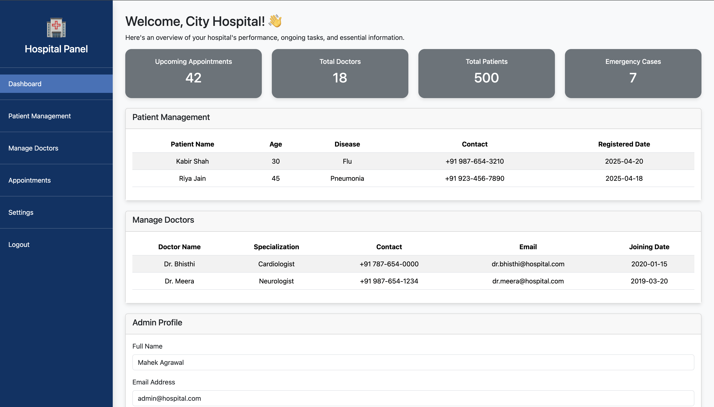

# DocVisitNow – Integrated Healthcare Management System

DocVisitNow is a web-based healthcare management platform designed to streamline and enhance interactions between patients, doctors, hospitals, and administrators. The system provides a centralized solution for appointment scheduling, medical history access, emergency management, and secure communication across multiple user roles.
A key innovation in DocVisitNow is its *Emergency Biometric Scanner*, which assists in identifying individuals involved in accidents by scanning their biometric data. This enables immediate access to patient details such as name, location, and emergency contact, allowing hospitals to initiate appropriate medical response and notify family members without delay.

Key Features

Role-Based Dashboards     
Separate and secure dashboards for Patients, Doctors, Hospitals, and Admins, each with customized access and features. 

Appointment Scheduling and Management    
Patients can easily book appointments with doctors, and hospitals can manage availability and schedules in real time.   

Medical History and Prescription Tracking    
Patients have access to their consultation history and prescribed medications. Doctors can update records and issue follow-up instructions. 

Emergency Biometric Scanner     
An integrated biometric recognition system that identifies patients in emergencies (e.g., road accidents), retrieves their medical profiles, and contacts registered emergency contacts. This feature significantly reduces response time and facilitates faster medical intervention.  

Secure Authentication System     
Enforces secure, role-specific login access to maintain confidentiality and ensure data protection.  

Administrative Controls   
Admins can manage system users, oversee hospital operations, and maintain data integrity across the platform.      

## 🖼️ Screenshots

### Homepage

### Patient Dashboard

### Doctor Dashboard

### Hospital Dashboard

### Admin Dashboard

### Emergency Face Scanner

---
Usefulness and Impact    

DocVisitNow addresses key challenges in the healthcare domain, including:    

Delays in emergency identification and treatment    
Lack of centralized access to patient records     
Inefficient appointment scheduling and communication    
Gaps in continuity of care due to fragmented data     
By integrating all major stakeholders into a single, responsive platform, DocVisitNow improves coordination, reduces administrative overhead, and enhances patient outcomes through better-informed medical decisions and faster interventions during critical situations. 

## Author

**Mahek Agrawal**     
GitHub: https://github.com/mahekagrawal16      
LinkedIn: https://linkedin.com/in/mahek-agrawal-503819255   
Email: mahek.suresh.aug2004@gmail.com    
